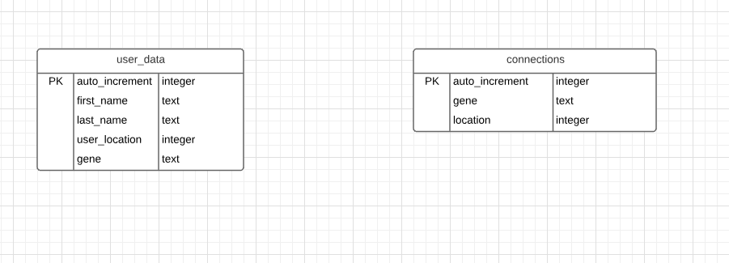
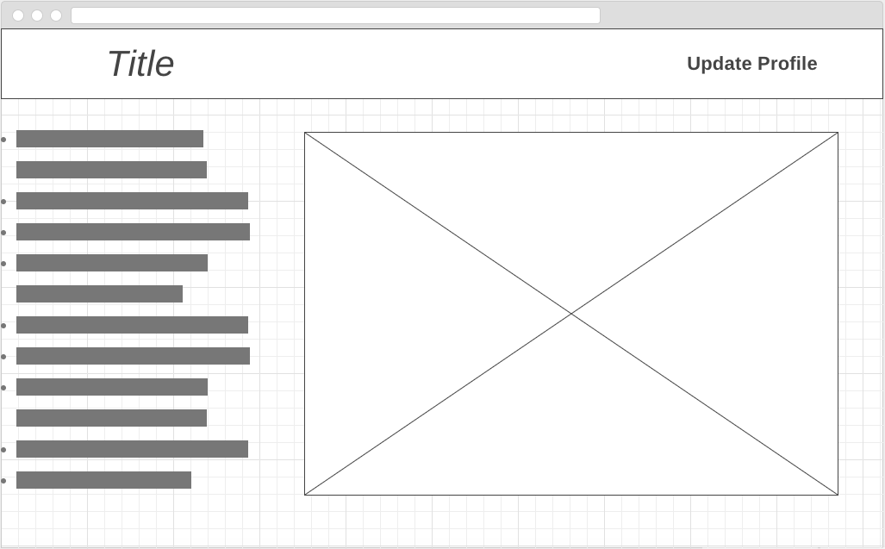
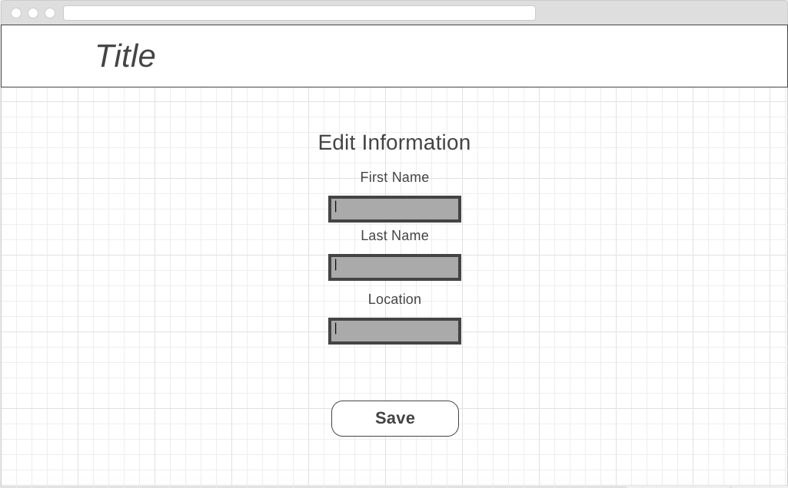

## Koncert-Kandi

## Project Description
  Koncert Kandi is a wearable tech in the form of a braclet. Each braclet has a LED light strip across the top, one button on the side, An IR reader and sender on the bottom, and micro USB port. Each braclet will be preloaded with it's own unique gene (colors and squence pattern) that no other braclet has. When the user first gets their braclet they can hold the button down to turn the device on. The braclet will turn on and start it's one gene pattern. When the user double taps the button and shakes hand with another Koncert Kandi wearer the unique gene light patter of each braclet will be transfered to each other via IR reader and sender on the bottom of the braclet. Giving each user an additional patter mode they can access by single tapping the button. They can now cylce through the different patterns. The more patters they collect the more they can cycle through. If they hold the botton down for 3 seconds it turns the braclet off. Once a wearer gets home they can plug the braclet into their computer and see a list of all the patters they have collected as well as an map with pins of all the other users home towns that they met at the event.

## Problem Statement
  When you attend a conert, convention, or festival one of the best parts is being around other people who share a passion or interest for the same topic. Intereactions between people is not naturally encouraged by the event. Even when you do interact with others these interactions can be quick and short lived. After you go home or even later in the event you have only the memory of that person. 

## How will your project solve this problem?
  Koncert-Kandi allows users to easily identify others at the same event with the device by it's bright LED lights and color. 
Each Koncert-Kandi has it's own unique gene and only by interacting with other users can you gain access to their gene. This encourages people to meet and talk to other people, spurring connection, and adding a cool experience to the event.  

## 5 user stories:

* User can turn on device
* User can see unique gene (color/patter)
* User can turn off device
* User can imput their info into a web portal
* User can see a map.

## What technologies do you plan to use?

* Johnny-Five
* React
* Node.js
* Express
* React Router
* Knex
* PSQL
* Firebase
* Heroku

## ERD - Entity Relationship Diagram

## Wireframes

